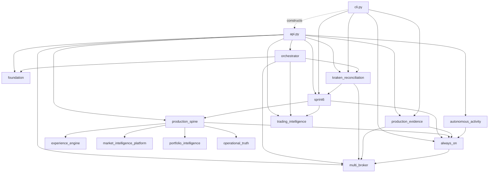

# AI Trader — Modularisation Discovery Pack

**Date:** 2026-08-02. **Source of truth:** current repository, `master` branch, commit `32d33a5a`
(working tree clean for `src/`, `tests/`, `mobile/` — no uncommitted application changes). This is a
factual companion to `architecture/CURRENT_STATE_FOR_REDESIGN_2026-08-02.md`, produced at ChatGPT's
request for deeper discovery input before designing the modularisation architecture. No application
code, configuration, database state, deployment state, or other documentation file was changed to
produce this report — it is read-only discovery.

**Methodology note (read before Section 1):** "Callers" and "downstream calls" were derived by
cross-referencing `self.<method>(`/`service.<method>(` call sites across `api.py` and `cli.py` via
grep, not by manually tracing every possible call path by hand. "Database tables read/written" for
each item were derived by mapping direct SQL literal occurrences (`FROM <TABLE>`, `INTO <TABLE>`,
`UPDATE <TABLE>`) to each function's line range, plus tables known to be touched by functions it calls
in other modules (documented separately, not re-derived from scratch for every helper). This is
reliable for direct, single-hop usage; it will under-count indirect multi-hop table access buried
several calls deep in another module. Where confidence is lower, this is stated explicitly rather than
presented as certain. Every genuine unknown is listed in Section 10, not smoothed over.

---

# 1. api.py Responsibility Inventory

`api.py` is 6,152 lines, two classes: `LocalApiService` (lines 256–4413, ~4,157 lines, the entire
business-logic + route-dispatch surface) and `ApiHandler` (lines 4414–6152, ~1,738 lines, the raw
`BaseHTTPRequestHandler` — auth, CORS, request parsing, error handlers). `LocalApiService` alone has
~120 methods; `ApiHandler` has ~14.

## 1a. Route dispatch (the `get`/`post` methods)

`get()` (line 689–811) and `post()` (line 812–880) are pure routing logic — a long if/elif chain
matching `path` to a handler call, no business logic of their own beyond query-param extraction
(`_first`, `_int_or_default`) and a couple of inline one-liners (`/healthz`, `/developer-dashboard`,
`/activity/founder-attention`'s small transform). **Proposed domain: api routing.** Every route is
enumerated with its target handler in Section 3 (HTTP API Contract Inventory) rather than duplicated
here — Section 3 is the authoritative per-route table.

## 1b. Significant `LocalApiService` methods (non-trivial business/presentation logic)

All 120 methods, grouped by rough responsibility area. Line ranges are start-line to the line before
the next `def` at the same indentation (from a full `grep -n "^    def "` pass — complete, not
sampled). "Domain" is a proposed target module per the classification list in the task spec.

| Method | Lines | Responsibility | Logic type | Tables (direct) | External calls | Domain |
|---|---|---|---|---|---|---|
| `__init__` | 257–304 | Constructs every subsystem object (`AuditDatabase`, `InvestmentIntelligenceDatabase`, `BenchmarkIntelligenceDatabase`, `InvestmentOrchestrator`) once per process; runs `_initialize_control`/`_initialize_report_schema`; calls `_apply_env_broker_auto_defaults`/`_apply_founder_kraken_live_authorization` unconditionally on every construction | Mixed (persistence + wiring) | `engine_control`, `TRADING_REPORTS` (via helpers) | none directly | administration |
| `reconcile_on_startup` | 305–348 | Reads `ORDER_INTENT_LOCKS`/`MANAGED_TRADE_EXITS`/`BROKER_TRADE_HISTORY` to detect orphaned/ambiguous state at boot | Business logic | `ORDER_INTENT_LOCKS`, `MANAGED_TRADE_EXITS`, `BROKER_TRADE_HISTORY` | none | operations |
| `notifications` / `ack_notifications` / `register_push_token_endpoint` / `dispatch_pending_push_notifications` | 349–380 | Thin wrappers over `multi_broker` notification functions | Mixed (routing+persistence) | `NOTIFICATION_EVENTS`, `PUSH_TOKENS` (via multi_broker) | Expo push (via `send_expo_push`) | operations |
| `refresh_crypto_universe` | 381–408 | Refreshes crypto symbol universe then calls `run_crypto_analysis` | Business logic | `CRYPTO_MASTER`, `CRYPTO_RESEARCH_SCORES` | CoinGecko-style crypto universe endpoint (via `seed_crypto_universe`) | research |
| `refresh_strategy_lab` | 409–518 | The real backtest/walk-forward job: ingests Alpaca daily candles, runs `run_strategy_backtest`/`run_walk_forward_validation` per stock-eligible strategy per symbol, evaluates promotion | Business logic (large) | `COMPANY_MASTER` (read), `HISTORICAL_CANDLES`, `STRATEGY_BACKTEST_RESULTS`, `STRATEGY_LAB_RUNS` (via trading_intelligence) | Alpaca `get_daily_bars` (fixed 2026-08-01 for per-symbol fault isolation) | research / learning |
| `run_crypto_analysis` | 519–688 | The `crypto-research` job body: research → propose → per-symbol freshness callback → end-of-cycle bookkeeping (notification/recommendation-set/research-run/enrichment) | Business logic (large) | `trade_audit`, `RECOMMENDATION_SETS`, `RESEARCH_RUNS`, `PRODUCTION_RESEARCH_EVIDENCE` (writes, many via helpers) | Kraken price fetch (via adapter), OpenAI (via `propose_crypto_trades`→`evaluate_trade_intelligence`) | research |
| `status` | 882–970 | Legacy/dashboard aggregate: last analysis time, recent activity, recommendations, broker panels, executive summary | Presentation (heavy aggregation) | `trade_audit`, `execution_events` (direct); many more via callees | none direct | presentation |
| `operations_health` / `phase5_status` / `sprint6_status` | 971–982 | Thin delegations to `always_on.operations_health` / `production_spine.phase5_status` / `sprint6`-derived status | Routing | none direct | none | operations |
| `autonomous_activity` / `production_activity` / `_filtered_production_timeline` | 983–1043 | Activity-timeline aggregation and query-filtered slicing for the mobile Activity screen | Presentation | via `autonomous_activity.py` | none | presentation |
| `operational_events` / `decision_journal` | 1044–1076 | Direct reads of `OPERATIONAL_EVENTS`/`DECISION_JOURNAL` with limit | Persistence (thin read) | `OPERATIONAL_EVENTS`, `DECISION_JOURNAL` | none | operations |
| `founder_experience_payload` | 1077–1198 | Large founder-facing aggregate: strategy performance, portfolio extremes, positions needing attention, crypto health, strategy validation, signal rankings | Presentation (very heavy aggregation) | `POST_TRADE_REVIEWS`, `EXPERIENCE_RECORDS`, `LEARNING_PROPOSALS` (direct) + many via helper methods below | none direct | presentation |
| `_latest_strategy_performance_rows` / `_portfolio_extremes` / `_positions_requiring_attention` / `_crypto_health_summary` / `_strategy_validation_summary` / `_signal_rankings` | 1199–1294 | Private helpers feeding `founder_experience_payload` | Presentation | `PERFORMANCE_INTELLIGENCE`, `PERFORMANCE_ATTRIBUTION`, `TRADE_SIGNALS` | none | presentation |
| `portfolio` | 1295–1320 | Broker-filtered portfolio view for the mobile Portfolio screen | Presentation | via `broker_panels`/`_exchange_portfolio` | none direct | presentation |
| `founder_brief` | 1321–1327 | Latest daily briefing text | Persistence (thin read) | `daily_briefings` | none | presentation |
| `operational_truth_status` | 1328–1354 | Canonical trade lifecycle + rejection reasons | Persistence (thin read) | `CANONICAL_TRADE_LIFECYCLE`, `LIFECYCLE_TRANSITION_REJECTIONS` | none | operations |
| `world_class_evidence` | 1355–1423 | Another large founder-facing evidence aggregate | Presentation (heavy) | `POST_TRADE_REVIEWS`, `EXPERIENCE_RECORDS`, `LEARNING_PROPOSALS` (direct) | none | presentation |
| `_portfolio_intelligence_summary` / `_future_broker_status` / `_data_availability_unknowns` / `_executive_first_conclusion` | 1424–1499 | Private presentation helpers | Presentation | none direct | none | presentation |
| `generate_report` | 1500–1505 | Thin delegate to report generation | Routing | none | none | reporting |
| `ask_ai_trader` / `_ask_ai_context` | 1506–1612 | Read-only "ask the app" chat feature — builds a large context blob and forwards to an LLM | Business logic | reads many tables for context | OpenAI (or configured provider) | presentation / research |
| `trading_report` / `report_page` / `_refresh_report_sources` / `_broker_learning_report_markdown` / `_write_trading_report` / `_record_trading_report` | 1613–1887 | Report generation pipeline (daily/weekly/monthly), markdown rendering, persistence | Mixed (business + persistence + presentation) | `TRADING_REPORTS`, `ORCHESTRATOR_DECISIONS`, `PORTFOLIO_SNAPSHOTS`, `PERFORMANCE_ATTRIBUTION`, `BROKER_TRADE_HISTORY` | none | reporting |
| `recommendations` | 1888–2029 | The per-row-expensive recommendation enrichment query (fixed 2026-08-01 to remove an oversized `LIMIT` floor) — `_proposal_already_executed`, `_latest_orchestrator_decision`, `_proposal_broker`, `broker_auto_trading_enabled` per row | Business logic | `trade_audit` (join `COMPANY_MASTER`/`INVESTMENT_WATCHLIST`) | none direct | research / execution |
| `companies` / `themes` / `benchmark_traders` / `benchmark_daily_brief` | 2030–2095 | Thin reads for equity/benchmark reference data | Persistence (thin read) | `COMPANY_MASTER`, `MARKET_THEMES`, `BENCHMARK_TRADERS`, `BENCHMARK_DAILY_RESEARCH` | none | presentation |
| `developer_status` | 2096–2128 | Diagnostic dump (python version, settings, etc.) | Presentation | none | none | diagnostic |
| `_refresh_asset_metadata_from_company_master` | 2129–2159 | Syncs `ASSET_METADATA` from `COMPANY_MASTER` | Business logic | `COMPANY_MASTER` (read), `ASSET_METADATA` (write, via portfolio_intelligence) | none | portfolio |
| `run_analysis` | 2160–2333 | The equity research job body (mirrors `run_crypto_analysis` structurally) | Business logic (large) | `COMPANY_MASTER`, `trade_audit` (via `AITradingAgent`) | Alpaca bars/news, OpenAI | research |
| `_record_production_research` / `_enrich_production_recommendations` | 2334–2409 | End-of-cycle evidence persistence + the `recommendations()`-based enrichment step | Business logic | `PRODUCTION_RESEARCH_EVIDENCE` | none direct | research |
| `_bootstrap_crypto_universe_from_kraken_permissions` | 2410–2466 | Seeds `CRYPTO_MASTER`/`CRYPTO_RESEARCH_SCORES` fallback from `KRAKEN_ALLOWED_PAIRS` when no external universe data is available | Business logic | `CRYPTO_MASTER` (upsert) | none | research |
| `set_trading_state` | 2467–2483 | Writes the global `engine_control.trading_state` (running/paused/stopped) | Persistence | `engine_control` | none | administration |
| `approve_and_execute` / `_proposal_with_manual_amount` / `_account_context_for_broker` | 2484–2584 | Manual (founder-initiated, non-autonomous) trade approval path | Business logic | `trade_audit` | broker adapter (`get_account`) | execution |
| `daily_learning_update` / `_manual_approval_auto_config` | 2585–2674 | Daily learning digest aggregation | Business logic | `PERFORMANCE_ATTRIBUTION`, `ORCHESTRATOR_DECISIONS`, `PORTFOLIO_SNAPSHOTS` | none | learning |
| `auto_execute_recommendations` (+ `_alpaca`/`_kraken` wrappers) | 2675–2878 | **The** autonomous execution loop: candidate query, freshness/guardrail pre-filter, per-candidate `orchestrator.evaluate_recommendation`, decision/skip bookkeeping | Business logic (the single most safety-critical method in the file) | `trade_audit` (read) | `orchestrator.evaluate_recommendation` → broker `place_bracket_order` | execution |
| `_render_api_json` / `_sync_broker_auto_trading_to_render` | 2879–2959 | Calls the Render API itself (a meta-operational dependency — this app calling its own hosting platform's API) | Business logic (mixed with I/O) | none | Render API (`urlopen`) | administration |
| `set_broker_auto_trading` | 2960–2984 | Thin delegate to `multi_broker.set_broker_auto_trading` (the function fixed 2026-08-01 for idempotent no-op-on-unchanged) | Routing | via multi_broker | none | brokers |
| `monitor_managed_exits` / `force_managed_exit` | 2985–3207 | Exit monitoring for open AI-managed positions — stop/target checks, trailing-stop logic, exit order submission | Business logic (large, safety-relevant) | `MANAGED_TRADE_EXITS` (via multi_broker) | broker `place_exit_order` | execution |
| `poll_broker_activity` (+ `_alpaca`/`_kraken`) | 3208–3309 | Broker trade-history polling and reconciliation trigger | Business logic | `BROKER_TRADE_HISTORY` | broker `get_orders`/`get_trade_history` | brokers |
| `capture_production_broker_snapshots` | 3310–3433 | The `evidence-snapshot` job body — portfolio value, trading permissions, founder-evidence generation for both brokers | Business logic (large) | `PORTFOLIO_SNAPSHOTS`, `PRODUCTION_BROKER_SNAPSHOTS` | both broker adapters' `get_account`/balances | operations |
| `broker_panels` / `_broker_trade_rows` / `_managed_exit_rows` / `_broker_trading_permissions` / `_ai_managed_open_trade_count` / `_kraken_ai_capital_ledger` / `_broker_managed_trade_capacity` | 3434–3698 | Broker panel data assembly for the mobile Command/Broker screens, including the isolated Kraken capital ledger presentation | Mixed (business + presentation) | `BROKER_TRADE_HISTORY`, `MANAGED_TRADE_EXITS`, `ORDER_INTENT_LOCKS` (direct) + Kraken ledger via `kraken_reconciliation` | broker adapters (`current_prices`, `get_account`) | brokers / portfolio |
| `_adapters` / `_active_broker_names` | 3699–3708 | Thin adapter-dict accessors | Routing | none | none | brokers |
| `executive_summary` / `founder_executive_summary` / `connection_readiness` | 3709–3825 | More founder-facing summary/presentation aggregation | Presentation | none direct | none | presentation |
| `_latest_broker_trade_any` / `_plain_learning_status` / `_latest_snapshot_summary` | 3826–3857 | Small presentation helpers | Presentation | `BROKER_TRADE_HISTORY`, `PERFORMANCE_ATTRIBUTION`, `PORTFOLIO_SNAPSHOTS` | none | presentation |
| `_unconfigured_exchange_portfolio` / `_exchange_portfolio` / `_alpaca_panel_portfolio` / `_live_alpaca_portfolio` | 3858–4022 | Per-broker portfolio-view construction | Mixed | none direct beyond broker calls | broker adapters | brokers / presentation |
| `_auto_config_for_broker` / `_apply_env_broker_auto_defaults` / `_apply_founder_kraken_live_authorization` | 4023–4080 | Auto-trade config resolution and the two `__init__`-time authorization calls (source of the 2026-08-01 notification-flood bug, since fixed at the `multi_broker.set_broker_auto_trading` level) | Business logic | via multi_broker | none | brokers / administration |
| `_continuous_research_status` / `_record_research_from_result` / `_record_research_funnel_from_result` / `_record_shadow_from_proposal` | 4081–4232 | Research-cycle bookkeeping shared by equity and crypto research jobs | Business logic | `RESEARCH_FUNNELS`, `SHADOW_TRADES` (via always_on) | none | research |
| `_latest_orchestrator_decision` / `_latest_daily_brief` / `_broker` / `_initialize_control` / `_initialize_report_schema` / `_control_state` | 4233–4277 | Small accessors + the two ad hoc schema-init methods (safe: called once from `__init__` only, see Section 5) | Mixed | `ORCHESTRATOR_DECISIONS`, `DAILY_BRIEFS`, `engine_control` | none | persistence |
| `_proposal_already_executed` / `_proposal_broker` | 4278–4306 | Per-candidate helper checks used inside `recommendations()`/`auto_execute_recommendations()` loops | Business logic | `trade_audit` | none | execution |
| `broker_decisions` / `order_intent_locks` / `release_order_intent_lock_for` | 4307–4372 | Read-only diagnostic endpoints + the guarded manual lock-release added 2026-08-01 | Persistence + guarded admin action | `BROKER_DECISIONS`, `ORDER_INTENT_LOCKS` | none | administration |
| `_connect` / `_row` / `_rows` / `_scalar` / `_count` | 4373–4406 | The generic SQL-execution helpers every other method in the file routes through | Persistence (foundational) | any (generic) | none | persistence |
| `_due_diligence_status` | 4407–4413 | Tiny helper | Presentation | `DUE_DILIGENCE_ASSESSMENTS` | none | presentation |

**`ApiHandler` (lines 4414–6152, ~14 methods):** `do_GET`/`do_POST`/`do_OPTIONS` (HTTP verb dispatch to
`LocalApiService.get`/`.post`), `log_message` (silences default stderr logging), `_read_body`,
`_client_ip`, `_is_locked_out`/`_record_auth_failure` (a simple in-memory IP lockout — **shared mutable
state, not per-request**, see Section 2), `_authorized` (bearer-token or `X-API-Key` check via
`hmac.compare_digest`, `/healthz` exempted), `_json` (response serialization), `_cors`, and five
`_on_*_error` static error-formatting helpers. **Proposed domain: api routing** (this whole class is
legitimately routing/transport-layer and is one of the cleanest extraction candidates — see Section 9).

---

# 2. Module Dependency Graph

**No circular imports exist in this codebase.** This was verified two ways: (1) every module's
top-of-file imports were traced by hand for the modules named in the task (below), and (2) the
application demonstrably runs and imports successfully in production and in this session's local test
runs — Python would raise `ImportError` at import time if a true cycle existed among these
synchronous, top-of-file imports, so the absence of any observed import failure is itself evidence.

## 2a. Plain-text dependency list (named modules)

```
api.py            -> agent, always_on, autonomous_activity, ai, alpaca, audit, benchmark, briefing,
                      broker_adapters, config, foundation, experience_engine,
                      market_intelligence_platform, intelligence, models, multi_broker, orchestrator,
                      canonical_trades, kraken_reconciliation, operational, operational_truth,
                      portfolio_intelligence, production_spine, production_evidence, sprint6,
                      scheduler, trading_intelligence   (20 first-party modules)
cli.py            -> agent, ai, alpaca, always_on, audit, benchmark, briefing, config, database,
                      execution, intelligence, kraken_reconciliation, production_evidence, proposals,
                      scheduler, sprint6                (does NOT import api.py's LocalApiService
                      directly for job dispatch logic — cli.py imports api.py only to construct
                      LocalApiService at process entrypoints, e.g. serve-api / run-job)
orchestrator.py   -> broker_adapters, canonical_trades, database, foundation, guardrails,
                      kraken_reconciliation, models, multi_broker, operational, trading_intelligence
sprint6.py        -> always_on, canonical_trades, database, guardrails, models, operational,
                      production_spine, trading_intelligence
foundation.py     -> database, models, operational                              (leaf-ish; no local
                      first-party dependents beyond database/models/operational)
production_spine.py -> always_on, database, experience_engine, market_intelligence_platform, models,
                      operational_truth, portfolio_intelligence
multi_broker.py   -> database, models, operational
kraken_reconciliation.py -> canonical_trades, database, models, multi_broker, sprint6
production_evidence.py -> always_on, database, models, multi_broker
autonomous_activity.py -> always_on, database, models
trading_intelligence.py -> database, models                                      (leaf; imported by
                      orchestrator, sprint6, api.py — never imports anything else first-party)
```

Lower-level modules (`always_on`, `operational`, `operational_truth`, `portfolio_intelligence`,
`canonical_trades`, `market_intelligence_platform`, `intelligence`, `benchmark`, `experience_engine`,
`audit`, `database_migration`) each import only `database`/`models` (plus `always_on.py` also imports
`multi_broker`, and `intelligence.py`/`benchmark.py` each import a small sibling data-constants module,
`intelligence_data.py`/`benchmark_data.py`).

## 2b. Mermaid diagram (named modules only, for readability — the full 38-module graph is denser than
useful to render)



## 2c. Findings

- **`api.py` is a textbook service locator.** It imports from 20 of the other 37 modules and is
  itself imported by exactly one file (`cli.py`), only to construct it. Nothing else in the codebase
  depends on `api.py` — every other module is a leaf or near-leaf relative to it. This is both the
  single strongest signal for where to start extraction, and the reason extraction is low-risk from a
  *dependency* standpoint (nothing "downstream" of api.py would need to change) even though it's
  high-effort from a *line-count* standpoint.
- **`kraken_reconciliation.py` → `sprint6.py` → `production_spine.py`, and separately `orchestrator.py`
  → `kraken_reconciliation.py` + `sprint6.py`, is a real but non-circular layering**: reconciliation
  code depends on the governance layer, which depends on the production-spine layer. This is a
  legitimate one-directional dependency, not a smell — but it does mean `kraken_reconciliation.py`,
  despite its name suggesting a narrow Kraken-specific concern, is not a leaf module and cannot be
  extracted in isolation without also carrying `sprint6`/`production_spine` along.
- **`trading_intelligence.py` and `foundation.py` are the two most reusable, dependency-light modules**
  among the "big" files (2,449 and 881 lines respectively) — both only depend on `database`/`models`.
  These are comparatively safe extraction/reuse targets.
- **Shared mutable module-level state exists in two places worth flagging:**
  1. The `_SCHEMA_LOCK`/`_INITIALIZED_SCHEMA_KEYS` per-process caches added 2026-08-01 (in
     `kraken_reconciliation.py`, `trading_intelligence.py`, `multi_broker.py`, `operational.py`,
     `foundation.py`, `production_spine.py`, `always_on.py`, `canonical_trades.py`) are intentional,
     correct, and each module-scoped (no cross-module sharing) — but a redesign that splits these
     modules must carry each cache with its owning module, not accidentally merge or lose them.
  2. `ApiHandler`'s `_is_locked_out`/`_record_auth_failure` IP-lockout mechanism (api.py, ~line 4483)
     appears to be simple in-process state (not database-backed, unlike everything else in the file)
     — worth confirming during extraction, since moving auth/routing to a separate process or module
     boundary could silently reset or fragment this state depending on how it's implemented.
- **No module was found importing presentation logic and business logic in a way that looks
  accidental** — the mixing is concentrated entirely in `api.py` itself (which legitimately owns both
  today, by virtue of being the whole API+business layer), not spread confusingly across the smaller
  modules.
- **Duplicated helper patterns:** the `_SCHEMA_LOCK`/`_INITIALIZED_SCHEMA_KEYS`/`_schema_key` triad is
  copy-pasted near-verbatim into 6+ modules rather than shared from one place — flagged already in
  the prior discovery document as the strongest candidate for a shared base pattern.
- **What would make extraction difficult:** primarily `api.py`'s sheer breadth of imports (any module
  split has to decide which of api.py's 20 dependencies each new sub-module needs) and the fact that
  `LocalApiService.__init__` constructs several stateful singletons (`self.audit`, `self.orchestrator`,
  `self.intelligence`, `self.benchmark`) that many methods across every responsibility area reach into
  — a naive split would need to either share one `LocalApiService`-like context object across new
  modules, or restructure how those singletons are constructed and passed around.

---

# 3. HTTP API Contract Inventory

All 86 route branches (62 GET + 24 POST, both counts confirmed by direct enumeration of `get()`/`post()`
above; there is also one `path.startswith("/reports/")` prefix match). **Authentication:** every route
requires `Authorization: Bearer <AI_TRADER_API_TOKEN>` or `X-API-Key: <token>` except `/healthz`
(explicitly exempted in `_authorized`); if `AI_TRADER_API_TOKEN` is unset, the server runs unauthenticated
(logged as a warning at startup — see `run_server`). IP lockout applies after repeated auth failures
(in-memory, not persisted). "Mobile-consuming" was determined by grepping literal path strings in
`mobile/App.js` — confirmed usage, not exhaustive proof of non-usage (see Section 10).

## 3a. GET routes

| Path | Handler | Mobile-consuming? | Classification |
|---|---|---|---|
| `/healthz` | inline | no (infra healthcheck) | diagnostic |
| `/status` | `status()` | unconfirmed | Founder UI |
| `/founder-evidence` | `founder_evidence_payload()` (production_evidence) | **yes** | production-critical |
| `/founder/trades` | `list_production_trade_evidence()` | unconfirmed | Founder UI |
| `/portfolio` | `portfolio()` | unconfirmed | Founder UI |
| `/founder-brief` | `founder_brief()` | **yes** | Founder UI |
| `/recommendations` | `recommendations()` | unconfirmed | trading-critical |
| `/intelligence/companies` | `companies()` | **yes** | Founder UI |
| `/intelligence/themes` | `themes()` | **yes** | Founder UI |
| `/benchmark-traders` | `benchmark_traders()` | unconfirmed | Founder UI |
| `/benchmark-daily-brief` | `benchmark_daily_brief()` | unconfirmed | Founder UI |
| `/developer-status` | `developer_status()` | unconfirmed | diagnostic |
| `/developer-dashboard` | inline (returns static HTML) | no | diagnostic |
| `/brokers` | `broker_panels()` | unconfirmed | trading-critical |
| `/performance-attribution` | `list_performance_attribution()` | unconfirmed | Founder UI |
| `/daily-learning-update` | `daily_learning_update()` | unconfirmed | Founder UI |
| `/operational-truth` | `operational_truth_status()` | unconfirmed | Founder UI |
| `/world-class-evidence` | `world_class_evidence()` | unconfirmed | Founder UI |
| `/operations-health` | `operations_health()` | unconfirmed | admin |
| `/scheduler-status` | `scheduler_status()` (always_on) | unconfirmed | admin |
| `/job-runs` | `list_job_runs()` (always_on) | unconfirmed | admin |
| `/shadow-trades` | `list_shadow_trades()` (always_on) | unconfirmed | admin |
| `/shadow-performance` | `shadow_performance()` (always_on) | unconfirmed | admin |
| `/research-funnel` | `list_research_funnels()` (always_on) | unconfirmed | admin |
| `/alpaca-inactivity-diagnosis` | `alpaca_inactivity_diagnosis()` (always_on) | unconfirmed | diagnostic |
| `/phase5-status` | `phase5_status()` (production_spine) | unconfirmed | admin |
| `/sprint6-status` | `sprint6_status()` | unconfirmed | admin |
| `/kraken-reconciliation` | `kraken_reconciliation_status()` | unconfirmed | trading-critical |
| `/broker-decisions` | `broker_decisions()` | unconfirmed (added 2026-08-01, diagnostic tool used this session) | diagnostic |
| `/order-intent-locks` | `order_intent_locks()` | unconfirmed (added 2026-08-01) | diagnostic |
| `/kraken-reconciliation/verify` | `verify_kraken_reconciliation()` | unconfirmed | admin |
| `/autonomous-activity` | `production_activity()` | unconfirmed | Founder UI |
| `/activity/status` | `founder_evidence_payload()["status"]` | unconfirmed | Founder UI |
| `/activity/summary` | `founder_evidence_payload()["summary"]` | unconfirmed | Founder UI |
| `/activity/timeline` | `_filtered_production_timeline()` | unconfirmed | Founder UI |
| `/activity/why-no-trade` | `founder_evidence_payload()["why_no_trade"]` | unconfirmed | Founder UI |
| `/activity/brokers` | `founder_evidence_payload()["brokers"]` | unconfirmed | Founder UI |
| `/activity/founder-attention` | inline | unconfirmed | Founder UI |
| `/operational-events` | `operational_events()` | unconfirmed | admin |
| `/decision-journal` | `decision_journal()` | unconfirmed | admin |
| `/trading-report` | `trading_report()` | **yes** | Founder UI |
| `/reports/*` (prefix) | `report_page()` | unconfirmed | Founder UI |
| `/notifications` | `notifications()` | **yes** | Founder UI |

## 3b. POST routes

| Path | Handler | Mobile-consuming? | Classification |
|---|---|---|---|
| `/run-analysis` | `run_analysis()` | **yes** | trading-critical |
| `/run-crypto-analysis` | `run_crypto_analysis()` | **yes** | trading-critical |
| `/start-trading` | `set_trading_state("running", ...)` | **yes** | trading-critical |
| `/pause-trading` | `set_trading_state("paused", ...)` | unconfirmed | trading-critical |
| `/resume-trading` | `set_trading_state("running", ...)` | **yes** | trading-critical |
| `/stop-trading` | `set_trading_state("stopped", ...)` | **yes** | trading-critical |
| `/auto-execute-recommendations` | `auto_execute_recommendations()` | **yes** | trading-critical |
| `/approve-and-execute` | `approve_and_execute()` | **yes** | trading-critical |
| `/broker-auto-trading` | `set_broker_auto_trading()` | **yes** | trading-critical |
| `/monitor-managed-exits` | `monitor_managed_exits()` | unconfirmed | trading-critical |
| `/force-managed-exit` | `force_managed_exit()` | **yes** | trading-critical |
| `/kraken-reconciliation/replay` | `replay_persisted_kraken_evidence()` | **yes** | admin |
| `/kraken-reconciliation/verify` | `verify_kraken_reconciliation()` (duplicate of the GET route, POST variant also exists) | unconfirmed | admin |
| `/kraken-reconciliation/resume` | `resume_kraken_entries_after_verification()` | unconfirmed | admin (structurally can never succeed — see prior session's finding that `explicit_order_ownership_exists` can't be proven for pre-2026-07-27 evidence) |
| `/kraken-reconciliation/founder-override` | `founder_override_kraken_hold()` | unconfirmed (added 2026-08-01; used once this session via curl, not confirmed wired into mobile UI) | admin |
| `/order-intent-locks/release` | `release_order_intent_lock_for()` | unconfirmed (added 2026-08-01, used via curl only) | admin |
| `/generate-report` | `generate_report()` | **yes** | Founder UI |
| `/generate-operational-report` | `generate_founder_operational_report()` | unconfirmed | admin |
| `/ask-ai-trader` | `ask_ai_trader()` | **yes** | Founder UI |
| `/notifications/ack` | `ack_notifications()` | unconfirmed | Founder UI |
| `/register-push-token` | `register_push_token_endpoint()` | unconfirmed (near-certainly used, push notifications are confirmed working — likely just not caught by literal-string grep) | Founder UI |

## 3c. Apparently-diagnostic-only / added-this-session endpoints

`/broker-decisions`, `/order-intent-locks`, `/order-intent-locks/release` did not exist before
2026-08-01 — they were added during this session's debugging specifically to expose data no endpoint
previously surfaced (why a candidate was rejected; which order-intent locks are stuck). They were
used via direct `curl` calls this session, not confirmed to be wired into the mobile UI. They are
genuinely useful and should very likely be kept and possibly surfaced in the app, but they are new
enough that "is anything relying on their exact response shape" is a non-issue for backward
compatibility — freely reshapeable during modularisation.

## 3d. Response-shape backward-compatibility risk

The endpoints confirmed consumed by the mobile app (marked "yes" above) are the ones whose response
shape must not change without a coordinated mobile release: `/founder-evidence`, `/founder-brief`,
`/intelligence/companies`, `/intelligence/themes`, `/trading-report`, `/notifications`,
`/run-analysis`, `/run-crypto-analysis`, `/start-trading`, `/resume-trading`, `/stop-trading`,
`/auto-execute-recommendations`, `/approve-and-execute`, `/broker-auto-trading`,
`/force-managed-exit`, `/kraken-reconciliation/replay`, `/generate-report`, `/ask-ai-trader`.
Everything marked "unconfirmed" should be treated as *possibly* mobile-consumed until verified by
either reading the mobile app's command/button-to-path lookup table directly (not fully traced in
this pass — see Section 10) or instrumenting the live API to log caller/path pairs for a period.

---

# 4. Database Table Ownership and Usage

~100 tables across 20 schema-owning files (full `CREATE TABLE IF NOT EXISTS` grep, verified fresh this
pass). **Production row counts/timestamps were not obtained** — this session's Render dashboard/log
MCP tools disconnected partway through the prior debugging session and did not reconnect; the hosted
API bearer token could answer some questions but table-level row counts require either direct
Postgres access (not available) or a dedicated counting endpoint (does not exist). This is listed
honestly in Section 10 rather than guessed.

Classification legend: **active** = confirmed written and/or read by code exercised in this or the
prior session's live debugging; **active-but-overlapping** = functionally active but its data overlaps
another table's purpose; **dormant-planned** = schema exists, writer/reader code exists, but no
evidence it fires in current production usage; **possibly-dead** = no confirmed reader anywhere in the
codebase; **unproven** = plausible but not directly observed either way this pass.

| Table | Owning module | Schema-init function | Notable readers | Notable writers | Classification |
|---|---|---|---|---|---|
| `trade_audit`, `execution_events`, `daily_briefings` | audit.py | `AuditDatabase.initialize()` (class-based) | api.py `status`/`recommendations`/`auto_execute_recommendations` | agent.py, orchestrator.py | active |
| `ORDER_INTENT_LOCKS` | multi_broker.py | `initialize_multi_broker_schema` | api.py `order_intent_locks`, orchestrator.py | orchestrator.py (`acquire_order_intent_lock`/`complete_order_intent_lock`) | active, safety-critical |
| `MANAGED_TRADE_EXITS` | multi_broker.py | (same) | api.py `monitor_managed_exits` | orchestrator.py `record_managed_trade_exit` | active |
| `BROKER_TRADE_HISTORY` | multi_broker.py | (same) | api.py broker panels | api.py `poll_broker_activity*` | active |
| `MECHANICAL_SEATBELT_EVENTS` | multi_broker.py | (same) | not observed directly this pass | orchestrator.py `record_seatbelt_event` | unproven (likely active, write-confirmed, no confirmed reader found) |
| `BROKER_AUTO_TRADING_SETTINGS` | multi_broker.py | (same) | `broker_auto_trading_enabled` | `set_broker_auto_trading` (idempotency-fixed 2026-08-01) | active |
| `BROKER_RUNTIME_STATE` | multi_broker.py | (same) | api.py broker panels, mobile Command screen | `update_broker_runtime` (per-symbol callback added 2026-08-01) | active |
| `CRYPTO_RESEARCH_SCORES` | multi_broker.py | (same) | `propose_crypto_trades` | `record_crypto_research_score` | active |
| `NOTIFICATION_EVENTS`, `PUSH_TOKENS` | multi_broker.py | (same) | `push-dispatch` job, mobile Notifications | `record_notification`, `register_push_token` | active |
| `RECOMMENDATION_SETS` | multi_broker.py | (same) | unproven direct reader this pass | `record_recommendation_set` | unproven |
| `PERFORMANCE_ATTRIBUTION` | multi_broker.py | (same) | api.py `founder_experience_payload`, reports | not found this pass — likely `daily_learning_update`/close-loop learning path | unproven |
| `KRAKEN_AI_CAPITAL_LEDGER`, `KRAKEN_AI_ORDER_OWNERSHIP`, `KRAKEN_RECONCILED_RESULTS`, `KRAKEN_RECONCILIATION_CASES`, `KRAKEN_RECONCILIATION_CONTROL` | kraken_reconciliation.py | `initialize_kraken_reconciliation_schema` (cached) | `/kraken-reconciliation` endpoint (used heavily this session) | `replay_kraken_evidence`, `set_reconciliation_hold`/`founder_override_kraken_hold` | **active, safety-critical** — directly exercised and fixed this session |
| `STRATEGY_REGISTRY`, `MARKET_REGIME_SNAPSHOTS`, `TRADE_SIGNALS`, `TRADING_COMMITTEE_REVIEWS`, `PROBABILITY_ESTIMATES`, `CONFIDENCE_CALIBRATION`, `PERFORMANCE_INTELLIGENCE`, `TRADE_LIFECYCLE` | trading_intelligence.py | `initialize_trading_intelligence_schema` (cached, fixed 2026-08-01) | `evaluate_trade_intelligence` | (same) | active |
| `HISTORICAL_CANDLES`, `STRATEGY_BACKTEST_RESULTS`, `STRATEGY_LAB_RUNS` | trading_intelligence.py | (same) | `refresh_strategy_lab` | `run_strategy_backtest`/`run_walk_forward_validation` | **active but structurally equity-only** — `refresh_strategy_lab` was crashing daily until fixed 2026-08-01; crypto has no equivalent ingestion |
| `STRATEGY_MATURITY_REGISTRY`, `STRATEGY_ENTITLEMENT_DECISIONS`, `STRATEGY_PROMOTION_DECISIONS`(production_spine) | sprint6.py / production_spine.py | `initialize_sprint6_schema`, `initialize_production_spine_schema` | `pre_execution_decision_packet` | `seed_default_strategy_registry`, promotion logic | active |
| `KILL_SWITCH_STATE` | sprint6.py | `initialize_sprint6_schema` | unproven direct reader this pass (no grep hit for a check against it in the hot execution path) | seeded at schema init only | **unproven / possibly dormant** — worth explicit follow-up: does anything actually consult the kill switch before submitting an order? |
| `DECISION_JOURNAL`, `OPERATIONAL_EVENTS`, `INCIDENT_LIFECYCLE`, `BROKER_EVENT_MAPPINGS`, `FOUNDER_OPERATIONAL_REPORTS`, `SPRINT6_WORKFLOW_OUTBOX` | sprint6.py | (same) | api.py `decision_journal`/`operational_events` | throughout | active |
| `PRODUCTION_RISK_SENTINEL_DECISIONS` | sprint6.py | (same) | not found as read anywhere this pass beyond its own module | `production_risk_sentinel_decision` | unproven — writer confirmed, no confirmed reader |
| `CAPITAL_ALLOCATION_HISTORY`, `BROKER_DECISIONS`, `EXECUTION_DECISIONS`, `INVESTMENT_POLICIES`, `RISK_POLICIES`, `BROKER_POLICIES`, `LEARNING_POLICIES`, `DUE_DILIGENCE_ASSESSMENTS`, `INVESTMENT_SCORES` | foundation.py | `initialize_foundation_schema` (cached, fixed 2026-08-01) | orchestrator.py, api.py `/broker-decisions` | `calculate_capital_allocation`, `record_broker_decision`, etc. | **active, safety-critical** — the position-sizing math fixed 2026-08-01 lives here |
| `CRYPTO_MASTER`, `CRYPTO_MARKET_DATA`, `CRYPTO_NEWS`, `CRYPTO_SENTIMENT`, `CRYPTO_ONCHAIN_METRICS`, `CRYPTO_TOKENOMICS`, `CRYPTO_PROJECT_ANALYSIS`, `CRYPTO_RISK`, `CRYPTO_BENCHMARK_ALIGNMENT`, `CRYPTO_DAILY_UPDATES`, `CRYPTO_TRADING_HISTORY` (11 of foundation.py's 20 tables) | foundation.py | (same) | **no reader found in this pass beyond `CRYPTO_MASTER` itself** (which IS actively read/written by the crypto research pipeline) | no writer found for the other 10 in this pass either | **CRYPTO_MASTER: active. The other 10: possibly-dead or dormant-planned** — confirms the prior discovery document's flag; this pass specifically looked for readers/writers and found none for onchain metrics, tokenomics, project analysis, sentiment, news, risk, benchmark alignment, daily updates, trading history, or market data as distinct tables. This needs a decision: were these meant for a data source that was never integrated (e.g. a paid crypto research API), or should they be removed? |
| `MARKET_DATA_OBSERVATIONS`, `MARKET_DATA_QUALITY_EVENTS`, `MARKET_REGIME_EVIDENCE`, `MULTI_TIMEFRAME_INTELLIGENCE`, `NEWS_CATALYST_EVIDENCE`, `MACRO_EVENT_EVIDENCE`, `FUNDAMENTAL_EVIDENCE` (market_intelligence_platform.py, all 7 tables) | market_intelligence_platform.py | `initialize_market_intelligence_schema` | **no confirmed reader or writer beyond schema init found in this pass** | none found | **possibly-dead** — same finding as the prior discovery document, re-confirmed this pass with a fresh, more targeted grep. This is the single clearest "dormant schema, never wired to a caller" case in the codebase. |
| `EXPERIENCE_RECORDS`, `HISTORICAL_ANALOGUES`, `LEARNING_PROPOSALS`, `POST_TRADE_REVIEWS` | experience_engine.py | `initialize_experience_engine_schema` | api.py `founder_experience_payload`/`world_class_evidence` (read) | `create_learning_proposal`/`generate_post_trade_review`/`record_experience`/`find_historical_analogues` | **schema active, read-path active, but write-path unproven in live production** — this workflow triggers on terminal (closed) trades; zero trades have gone terminal in production as of this session, so these tables are very likely still empty in production despite being fully wired |
| `CLOSED_LOOP_LEARNING_RUNS`, `PORTFOLIO_MANAGER_DECISIONS`, `PRODUCTION_SPINE_SNAPSHOTS`, `WORKER_SUPERVISION_RUNS`, `MARKET_DATA_GATEWAY_RUNS`, `CANONICAL_RECONCILIATION_CASES` | production_spine.py | `initialize_production_spine_schema` (cached, fixed 2026-08-01) | `portfolio_manager_decision` (the concentration-check bug fixed 2026-08-01 lives here) | (same) | active |
| `PORTFOLIO_SNAPSHOTS`, `RESEARCH_RUNS`, `CRYPTO_ASSET_MASTER` | operational.py | `initialize_operational_schema` (cached, fixed 2026-08-01) | api.py reports, `latest_pnl_snapshot` (the weekly-loss guardrail bug fixed 2026-08-01 reads from here) | `record_portfolio_snapshot` | **active, safety-critical** |
| `BROKER_RECONCILIATION_RUNS`, `CANONICAL_TRADE_LIFECYCLE`, `LIFECYCLE_TRANSITION_REJECTIONS`, `TRADE_EXCURSIONS`, `TRADE_EXECUTION_COSTS`, `TRADE_R_MULTIPLES` | operational_truth.py | `initialize_operational_truth_schema` | api.py `operational_truth_status` | `reconcile_broker_trade_rows` | active |
| `ASSET_METADATA`, `PORTFOLIO_CORRELATION_WARNINGS`, `PORTFOLIO_EXPOSURE_SNAPSHOTS`, `PORTFOLIO_RISK_CONTRIBUTIONS`, `PORTFOLIO_STRESS_TESTS` | portfolio_intelligence.py | `initialize_portfolio_intelligence_schema` (**not cached** — genuinely still vulnerable, see Section 5) | `calculate_portfolio_exposure` (called once per candidate in the governance chain — confirmed hot path) | (same) | active, safety-critical, still-unfixed schema-reinit risk |
| `PRODUCTION_BROKER_SNAPSHOTS`, `PRODUCTION_FOUNDER_EVIDENCE_SNAPSHOTS`, `PRODUCTION_LEARNING_EVIDENCE`, `PRODUCTION_RECOMMENDATION_EVIDENCE`, `PRODUCTION_RESEARCH_EVIDENCE`, `PRODUCTION_TRADE_EVIDENCE` | production_evidence.py | `initialize_production_evidence_schema` (cached) | `/founder-evidence` (confirmed mobile-consumed) | `capture_production_broker_snapshots`, research jobs | active |
| `LOGICAL_TRADES`, `LOGICAL_TRADE_EVENTS`, `LOGICAL_TRADE_FILLS` | canonical_trades.py | `initialize_canonical_trade_schema` (cached) | orchestrator.py, kraken_reconciliation.py | orchestrator.py `register_execution_intent`/`link_broker_order` | active, safety-critical (the canonical cross-broker trade representation) |
| `SCHEDULED_JOB_RUNS`, `WORKER_HEARTBEATS`, `OPERATIONS_INCIDENTS`, `RESEARCH_FUNNELS`, `SHADOW_TRADES` | always_on.py | `initialize_always_on_schema` (cached) | `/job-runs`, `/scheduler-status` | worker loop, `record_operations_incident` (alerting-fixed 2026-08-01) | active, safety/reliability-critical |
| `COMPANY_MASTER`, `COMPANY_FINANCIALS`, `COMPANY_DAILY_UPDATES`, `INVESTMENT_WATCHLIST`, `MARKET_THEMES` | intelligence.py | `InvestmentIntelligenceDatabase.initialize()` (class-based) | `run_analysis`, `refresh_strategy_lab` | `AITradingAgent`, equity research | **`COMPANY_MASTER`/`INVESTMENT_WATCHLIST`: active. `COMPANY_FINANCIALS`/`COMPANY_DAILY_UPDATES`: unproven** — no confirmed reader/writer found this pass beyond schema init |
| `BENCHMARK_TRADERS`, `BENCHMARK_DAILY_RESEARCH` | benchmark.py | `BenchmarkIntelligenceDatabase.initialize()` (class-based) | `/benchmark-traders`, `/benchmark-daily-brief` | not found this pass | **read path confirmed active, write path unproven** — the benchmark data itself may be seeded manually/offline rather than by a running job |
| `ORCHESTRATOR_DECISIONS`, `AUTO_TRADE_EVENTS`, `DAILY_BRIEFS` | orchestrator.py | `InvestmentOrchestrator.initialize()` (class-based) | api.py reports, `founder_brief` | `orchestrator.py` throughout | active |
| `engine_control`, `TRADING_REPORTS` | api.py (ad hoc, not a standalone `initialize_*_schema`) | `_initialize_control`/`_initialize_report_schema` (both called once from `__init__`, effectively safe) | `set_trading_state`, `/trading-report` | (same) | active |
| `PRODUCTION_DATABASE_MIGRATIONS` | database_migration.py | inline in `migrate_sqlite_runtime_to_postgres` | one-time migration tooling only | (same) | migration-only |

**Test-only tables:** none found — all schemas are production schemas also exercised by tests against
temporary SQLite files, not separate test-only table definitions.

---

# 5. Schema Initialization Inventory

25 distinct schema-management mechanisms found: 14 standalone `initialize_*_schema(db_path)`
functions, 4 class-based `__init__(..., initialize_schema=True)` + `self.initialize()` patterns
(`AuditDatabase`, `BenchmarkIntelligenceDatabase`, `InvestmentIntelligenceDatabase`,
`InvestmentOrchestrator`), 2 ad hoc methods on `LocalApiService` itself (`_initialize_control`,
`_initialize_report_schema`), and `database_migration.py`'s one-time inline schema statement.

| Module / mechanism | Process-level cache? | Lock? | Seed writes? | Concurrency-safe? | Called during normal request/job construction? | Risk |
|---|---|---|---|---|---|---|
| `kraken_reconciliation.initialize_kraken_reconciliation_schema` | **yes** (`_SCHEMA_LOCK`/`_INITIALIZED_SCHEMA_KEYS`) | yes | yes (control row, ledger seed) | yes | yes, via `_ensure_schema` | fixed 2026-08-01 |
| `trading_intelligence.initialize_trading_intelligence_schema` | **yes** | yes | yes (strategy registry) | yes | yes, via `evaluate_trade_intelligence` per candidate | fixed 2026-08-01 (was the ~15s-per-candidate `load_trading_policy` cost driver's sibling) |
| `multi_broker.initialize_multi_broker_schema` | **yes** | yes | yes (default broker rows) | yes | yes, extremely widely (called from nearly every function in the module) | fixed 2026-08-01 |
| `operational.initialize_operational_schema` | **yes** | yes | no | yes | yes | fixed 2026-08-01 |
| `foundation.initialize_foundation_schema` | **yes** | yes | yes (default policies — the ~15s-per-candidate cost driver) | yes | yes, via `load_trading_policy` per candidate | fixed 2026-08-01 |
| `production_spine.initialize_production_spine_schema` | **yes** | yes | no | yes | yes, via `portfolio_manager_decision`/sentinel per candidate | fixed 2026-08-01 |
| `always_on.initialize_always_on_schema` | yes (pre-existing, independent of the 2026-08-01 fix batch) | yes | no | yes | yes | low |
| `canonical_trades.initialize_canonical_trade_schema` | yes (pre-existing) | yes | no | yes | yes | low |
| `production_evidence.initialize_production_evidence_schema` | yes (fixed 2026-08-01) | yes | no | yes | yes | low |
| `portfolio_intelligence.initialize_portfolio_intelligence_schema` | **no** | no | no | **not verified — presumed no** | **yes, called from `calculate_portfolio_exposure`, confirmed hot path (once per candidate through the governance chain)** | **genuinely still at risk — this is the strongest concrete follow-up finding of this pass; same bug class as the 6 already fixed, not yet addressed** |
| `sprint6.initialize_sprint6_schema` | no direct cache, **but** `_ensure_sprint6_schema` wraps it with `if not uses_postgres(): initialize_sprint6_schema(...)` — a complete no-op on Postgres (production's backend) after the very first process-wide call elsewhere seeds it (via kraken_reconciliation's cached `_ensure_schema`) | no | yes (kill-switch row) | on Postgres, effectively yes via the skip guard; on SQLite, no | yes, but low call-site count (3 real callers found: kraken_reconciliation's cached wrapper, one `LocalApiService.__init__` call, and `_ensure_sprint6_schema` itself) | **low in production (Postgres) given the skip guard; a workaround, not a proper fix — flagged for the redesign to replace with the real per-process cache pattern used elsewhere, since the current protection is backend-specific and easy to lose accidentally** |
| `experience_engine.initialize_experience_engine_schema` | no | no | no | not verified | yes, 4 internal call sites (`create_learning_proposal`, `generate_post_trade_review`, `record_experience`, `find_historical_analogues`) — each fires once per completed/terminal trade or learning-workflow item, not once per research candidate | **low today** (this workflow has never fired end-to-end in production — zero terminal trades) **but will become a real risk the moment trades start closing and this path gets exercised at volume** |
| `market_intelligence_platform.initialize_market_intelligence_schema` | no | no | no | not verified | single internal call site found, plus one `LocalApiService.__init__` call | low (module appears largely dormant — see Section 4) |
| `operational_truth.initialize_operational_truth_schema` | no | no | no | not verified | **6 internal call sites** across `operational_truth.py` (broker-reconciliation functions) — not individually traced for loop context in this pass | **unverified, worth a closer look** — 6 call sites is enough that this warrants the same scrutiny `portfolio_intelligence.py` got, not yet done in this pass |
| `audit.AuditDatabase.initialize()` | effectively yes — called exactly once, from `__init__`, guarded by `initialize_schema: bool` | n/a (single-shot) | no | yes (single construction per process) | once per `LocalApiService`/`AuditDatabase` construction only | **low** — structurally safe despite lacking the shared cache pattern, because it never re-runs within a process's lifetime |
| `benchmark.BenchmarkIntelligenceDatabase.initialize()` | same as above | n/a | no | yes | same | low |
| `intelligence.InvestmentIntelligenceDatabase.initialize()` | same as above | n/a | no | yes | same | low |
| `orchestrator.InvestmentOrchestrator.initialize()` | same as above | n/a | no | yes | same | low |
| `api.py._initialize_control` / `_initialize_report_schema` | effectively yes — both called exactly once, from `LocalApiService.__init__` only | n/a | yes (`engine_control` default row) | yes | once per process | low |
| `database_migration.py` inline schema | n/a (one-time CLI migration tool) | n/a | no | n/a (not run concurrently by design) | only via the `migrate-sqlite-to-postgres` CLI command | none |

**Opportunity identified, not implemented:** a genuine shared convention (e.g. a small base
class or decorator implementing the `_SCHEMA_LOCK`/`_INITIALIZED_SCHEMA_KEYS`/`_schema_key` triad
once) would eliminate both (a) the current copy-paste duplication across 8 modules and (b) the risk
of a 9th module repeating the same mistake in the future, as `portfolio_intelligence.py` already has.
The class-based pattern (`audit.py`/`benchmark.py`/`intelligence.py`/`orchestrator.py`) achieves the
same safety property through a different, arguably simpler mechanism (construct-once objects rather
than a cache dict) — worth considering whether the redesign standardises on the cache-function pattern,
the construct-once-object pattern, or a single new convention that supersedes both.

---

# 6. Safety-Critical Capability Map

| Capability | Authoritative implementation | Secondary backstop | Tables | Tests | API/UI exposure | Migration risk |
|---|---|---|---|---|---|---|
| Order-intent locking | `multi_broker.acquire_order_intent_lock`/`complete_order_intent_lock`/`release_order_intent_lock` (orchestrator.py calls these around `place_bracket_order`) | none — this *is* the backstop for duplicate submission | `ORDER_INTENT_LOCKS` | `tests/test_multi_broker_platform.py` (contains `order_intent_lock` coverage) | `GET /order-intent-locks`, `POST /order-intent-locks/release` (both added 2026-08-01) | **High if mishandled** — the deliberate design (a lock only releases on a *definite* broker "no order placed" answer; a killed process leaves it stuck forever by design) must survive any refactor. A redesign that "cleans up" this code without understanding *why* it looks asymmetric could silently reintroduce double-submission risk. |
| Duplicate-submission prevention | same as above (order-intent locking IS the duplicate-submission mechanism) | Kraken-side: `userref` on `AddOrder` payload (broker_adapters.py) provides some idempotency at the exchange level too | same | same | same | same |
| Scheduled-job idempotency | `always_on.claim_scheduled_job` (idempotency key = `job_name:scheduled_for`) | none | `SCHEDULED_JOB_RUNS` | `tests/test_always_on_operations.py::test_scheduled_jobs_are_idempotent` | `/job-runs` | Low — well-isolated, single table, single function, well-tested |
| Kraken AI capital isolation | `api.py._kraken_trading_allocation_gbp`/`_kraken_ai_capital_ledger` (equity scoped to `min(allocation, actual free cash)`, never the full account); `kraken_reconciliation.kraken_capital_ledger_summary` (`personal_holdings_included: False` by construction) | `orchestrator.py`'s `_snapshot_equity_basis_matches_context` guard (fixed 2026-08-01 to also cover the weekly/monthly loss checks, not just drawdown) | `KRAKEN_AI_CAPITAL_LEDGER`, `PORTFOLIO_SNAPSHOTS` | `tests/test_orchestrator.py` (weekly-loss guard test added 2026-08-01), `tests/test_kraken_reconciliation.py` | `/kraken-reconciliation`, `/brokers` | **High** — this is the exact capability whose gap caused two live-trading-blocking bugs fixed 2026-08-01 (whole-account P&L compared against isolated equity; empty-portfolio concentration divide-by-zero). Any redesign must keep every risk calculation scoped correctly per broker/sleeve, verified by test, not just by convention. |
| Kraken order-size and allocation limits | `broker_adapters.KrakenAdapter._validate_live_order` (`KRAKEN_MIN_ORDER_GBP`/`KRAKEN_MAX_ORDER_GBP`/`KRAKEN_TRADING_ALLOCATION_GBP`) | none — this is itself the backstop, deliberately independent of the governance chain above it | none (env-var driven, not table-driven) | `tests/test_developer_experience.py`, `tests/test_multi_broker_platform.py` (both reference `KRAKEN_MIN_ORDER_GBP`/`KRAKEN_MAX_ORDER_GBP`) | trading permissions block of `/brokers` | Low-medium — simple, well-isolated, but env-var-driven limits are easy to silently change via deployment config rather than code, worth flagging as a migration risk if the redesign moves config handling |
| Kraken allowed-pair restrictions | same `_validate_live_order` (`KRAKEN_ALLOWED_PAIRS`) | none | none | same as above | same | same |
| Kraken buy-only entry enforcement | same `_validate_live_order` (`KRAKEN_BUY_ONLY_ENTRIES`) | none | none | not directly confirmed this pass | same | Low |
| Reconciliation hold | `kraken_reconciliation.KRAKEN_RECONCILIATION_CONTROL`/`set_reconciliation_hold`/`founder_override_kraken_hold` | `orchestrator.evaluate_recommendation`'s explicit `reconciliation_control(...)["hold_new_entries"]` check before approving a Kraken trade | `KRAKEN_RECONCILIATION_CONTROL` | `tests/test_kraken_reconciliation.py` | `/kraken-reconciliation`, `/kraken-reconciliation/verify`, `/resume`, `/founder-override` (added 2026-08-01) | **Medium** — the standard verify→resume path can structurally never pass for evidence predating 2026-07-27 (documented finding from the prior session); the founder-override path bypasses verification entirely on manual authorization. A redesign must preserve the distinction between the two paths, not merge them. |
| Strategy maturity and entitlement | `sprint6.strategy_entitlement_decision`, `STRATEGY_MATURITY_REGISTRY`/`STRATEGY_ENTITLEMENT_DECISIONS` | `seed_default_strategy_registry` bootstraps every named strategy capped at paper/shadow/manual by default | `STRATEGY_MATURITY_REGISTRY`, `STRATEGY_ENTITLEMENT_DECISIONS`, `STRATEGY_PROMOTION_DECISIONS` | `tests/test_sprint6_institutional_spine.py` | `/sprint6-status` | Medium |
| Portfolio concentration | `portfolio_intelligence.proposed_trade_portfolio_impact`/`calculate_portfolio_exposure` | none | `PORTFOLIO_EXPOSURE_SNAPSHOTS`, `PORTFOLIO_CORRELATION_WARNINGS` | `tests/test_world_class_transformation.py` (concentration test added/verified 2026-08-01) | via `production_spine.portfolio_manager_decision`, no direct UI | **High** — the empty-denominator bug fixed 2026-08-01 permanently blocked every first trade for any broker/asset-class; `portfolio_intelligence.py`'s schema init is also the one confirmed-still-vulnerable schema-reinit risk (Section 5) |
| Risk engine | `guardrails.validate_trade_proposal` | called both directly in `orchestrator.evaluate_recommendation` and again inside `pre_execution_decision_packet` (deliberate double-check, not redundant by accident) | none (stateless validation) | `tests/test_guardrails.py` | none direct | Low |
| Production risk sentinel | `sprint6.production_risk_sentinel_decision` | none confirmed | `PRODUCTION_RISK_SENTINEL_DECISIONS` | `tests/test_sprint6_institutional_spine.py` | none direct | Medium — writer confirmed, no confirmed reader of the decisions table beyond its own module (Section 4) |
| Kill switch | `sprint6.KILL_SWITCH_STATE` table + schema seed | **none found this pass** | `KILL_SWITCH_STATE` | `tests/test_sprint6_institutional_spine.py` (references kill_switch) | none found | **Unproven whether this is actually consulted in the live execution path** — flagged as a real open question, not confirmed either way |
| Managed exits | `api.py.monitor_managed_exits`/`force_managed_exit`, `multi_broker.MANAGED_TRADE_EXITS` | broker-level stop/take-profit orders placed at entry time (the exit order itself, not just app-side monitoring) | `MANAGED_TRADE_EXITS` | `tests/test_multi_broker_platform.py`, `tests/test_production_evidence.py` | `POST /monitor-managed-exits`, `POST /force-managed-exit` | Medium |
| Broker reconciliation | `operational_truth.reconcile_broker_trade_rows`, `kraken_reconciliation.replay_kraken_evidence` | none | `BROKER_RECONCILIATION_RUNS`, `CANONICAL_TRADE_LIFECYCLE` | not directly confirmed for `operational_truth.py` this pass | `/operational-truth` | Medium |
| Alpaca paper-only enforcement | `alpaca.AlpacaCredentials.validate_paper` (`"paper-api.alpaca.markets" not in base_url` raises) | `guardrails.paper_trading_only` check inside `evaluate_recommendation` | none | not directly confirmed this pass | none direct | Low — simple, single check, but worth a dedicated test if one doesn't already exist (not confirmed either way this pass) |

---

# 7. Test Coverage Map

236–239 tests across 22 files (count varies slightly run-to-run per session notes — a known flaky
test, `test_phase5_production_spine.py::test_phase5_status_reports_attention_until_production_database_ready`,
appears timing-sensitive and occasionally fails only when run as part of the full suite, not in
isolation; not investigated further this pass).

| Test file | Test count | Primary coverage |
|---|---|---|
| `test_multi_broker_platform.py` | 34 | multi_broker.py broadly: order-intent locks, managed exits, broker settings |
| `test_developer_experience.py` | 28 | api.py developer/diagnostic surface, Kraken order-size env vars |
| `test_always_on_operations.py` | 25 | always_on.py: idempotency, worker health, incident/notification alerting (2 tests added 2026-08-01) |
| `test_sprint6_institutional_spine.py` | 20 | sprint6.py: kill switch, concentration, sentinel, strategy maturity/entitlement |
| `test_orchestrator.py` | 18 | orchestrator.py: `evaluate_recommendation`, weekly-loss guard (added 2026-08-01) |
| `test_production_completion.py` | 15 | production_evidence.py / broader production-readiness checks |
| `test_trading_intelligence.py` | 14 | trading_intelligence.py: schema caching, strategy evaluation |
| `test_production_evidence.py` | 13 | production_evidence.py |
| `test_sprint5_operational.py`, `test_phase5_production_spine.py`, `test_foundation_sprint.py` | 9 each | earlier sprint-era coverage; foundation.py's capital allocation |
| `test_database.py` | 8 | database.py backend selection |
| `test_world_class_transformation.py`, `test_kraken_reconciliation.py`, `test_autonomous_activity.py` | 6 each | concentration-fix coverage, kraken_reconciliation.py, autonomous_activity.py |
| `test_strategy_lab.py` | 4 | `refresh_strategy_lab`, including the 2026-08-01 per-symbol fault-isolation fix |
| `test_guardrails.py`, `test_alpaca_client.py` | 3 each | guardrails.py; alpaca.py (2026-08-01 added the "different error phrasing" regression test) |
| `test_intelligence.py`, `test_benchmark_api.py`, `test_asset_metadata_refresh.py` | 2 each | intelligence.py, benchmark.py, portfolio_intelligence.py's asset-metadata sync |
| `test_end_to_end.py` | 1 | broad smoke test |
| `test_cli_startup.py` | 4 (module-level `def test_`, not class methods — counted separately) | cli.py startup; contains the 2 tests that error under this session's Windows sandbox (a local environment permissions issue with a temp directory, not a code defect — confirmed pre-existing and unrelated to any 2026-08-01 change) |

## Findings

- **Strong behavioural protection:** `multi_broker.py`, `always_on.py`, `sprint6.py`, `orchestrator.py`
  — all have double-digit test counts covering their safety-relevant behaviour, and all four received
  new/updated tests during 2026-08-01's bug fixes (evidence the test suite is actually used as a
  correctness gate, not just a formality).
- **Only unit-level / thin protection:** `portfolio_intelligence.py` (2 tests total, `test_asset_metadata_refresh.py`
  + a reference in `test_world_class_transformation.py`) despite owning the still-unfixed schema-reinit
  risk and the (now-fixed) concentration bug — this module's test depth doesn't match its safety
  criticality. `operational_truth.py` has **no dedicated test file found** — `tests/test_*.py` naming
  didn't surface one, and Section 5's flagged "6 internal schema-init call sites, not traced for loop
  context" compounds this gap.
- **Production-critical paths lacking dedicated tests (as far as this pass found):** the kill-switch
  consultation question from Section 6 (is it actually checked before order submission — no test found
  either confirming or denying this); `Alpaca paper-only enforcement`'s two enforcement points
  (`AlpacaCredentials.validate_paper` and the `guardrails.paper_trading_only` check) don't have a
  test file grep hit confirming either is exercised.
- **API contracts without response-shape tests:** none of the 86 routes appear to have a dedicated
  "does this endpoint's response shape match what the mobile app expects" test — coverage is at the
  underlying business-logic-function level (e.g. `founder_evidence_payload`'s content), not at the
  HTTP-contract level. This matters directly for Section 3's backward-compatibility concern: there is
  currently no automated way to detect a response-shape regression during extraction.
- **Safety features relying only on indirect tests:** `Kraken buy-only entry enforcement` and `Kraken
  allowed-pair restrictions` are covered by the same `_validate_live_order` tests as order-size limits
  (in `test_developer_experience.py`/`test_multi_broker_platform.py`) rather than having their own
  dedicated cases — a change that broke buy-only enforcement specifically might not be caught if the
  existing tests only exercise the size/allocation paths.
- **Recommended characterization tests before any api.py extraction:** (1) one response-shape snapshot
  test per mobile-consumed endpoint (Section 3d's 18 confirmed routes, at minimum) capturing the
  current JSON shape before any refactor touches the handler; (2) a dedicated kill-switch test that
  either confirms it gates order submission or documents that it currently doesn't; (3) an
  `operational_truth.py` test file, given it currently has none; (4) a portfolio_intelligence.py test
  matching the depth given to multi_broker.py/orchestrator.py, given its confirmed still-open
  schema-reinit risk.

---

# 8. Mobile Architecture Snapshot

**This is unusually stark and worth stating plainly:** the entire mobile application is essentially
one file. `mobile/App.js` is 3,713 lines. The only other source files are `mobile/lib/founderPresentation.js`
(332 lines — extracted, testable presentation-logic helpers, per the AT-ED-003 UI pass referenced in
prior session memory) and its companion `mobile/lib/founderPresentation.test.js` (260 lines). That's
the complete first-party source tree — 4,316 lines total across 3 files, roughly 86% of it in one file.

- **Screen structure:** not component-file-per-screen. A single `const SCREENS = ['Dashboard',
  'Activity', 'Recommendations', 'Portfolio', 'Market', 'Learning']` array (line 37) drives a manual
  `if (screen === 'X') { ... }` conditional-render chain inside one large root component — not React
  Navigation's `Tab.Screen`/route-object pattern. Two large named sub-components were found
  (`ExecutiveDashboard` at line 889, `PortfolioCommandCentre` at line 957) suggesting *some*
  extraction into named functions already happened for the two biggest screens, but the rest of the
  screen logic (Activity, Recommendations, Market, Learning) appears to live inline in the root
  component rather than as separately named functions.
- **Shared presentation logic:** `mobile/lib/founderPresentation.js` is the one deliberately-extracted,
  independently-tested module — confirmed by its test file's own comment: *"Plain Node assert-based
  tests ... no test framework is installed for this project ... run directly with `node
  mobile/lib/founderPresentation.test.js`."* This is the template for what further extraction from
  `App.js` could look like.
- **API client organization:** one `request(path, options)` async helper (line 568) wrapping `fetch`
  with a timeout/abort-controller and bearer-token auth header — not a generated/typed client, not
  organized per-domain (no `activityApi.js`/`brokersApi.js` etc.). All ~20+ confirmed-used endpoints
  (Section 3) funnel through this single function with the path as a runtime string, often built from
  a lookup table rather than a literal at the call site (only 2 literal-string call sites were found
  directly at `request(...)`; the rest resolve `path` from a variable, not fully traced to its origin
  in this pass — see Section 10).
- **Cross-screen status computation:** `founderPresentation.js` contains many small pure functions
  (e.g. `brokerOverallReadiness`, per prior session memory) that compute presentation-level status
  labels shared across screens — this is the one place genuine cross-screen logic has already been
  centralized rather than duplicated per screen.
- **Files mixing multiple responsibilities:** `App.js` itself is the single file mixing navigation,
  all screen rendering, all API calls, and (based on the function list found — `operationsTone`,
  `summaryTone`, `activityStatusTone`, `formatReconciliation`, `formatDuration`, etc., dozens of small
  formatting/tone-computation functions defined inline rather than in `founderPresentation.js`)
  presentation-formatting logic that arguably belongs in the shared lib alongside
  `brokerOverallReadiness` and friends.
- **Build/validation tooling:** `package.json` scripts are `start`/`android`/`ios`/`web` (Expo) only —
  **no `lint`, `typecheck`, or `test` script defined.** The one existing test file must be run manually
  with `node mobile/lib/founderPresentation.test.js`, not via `npm test` (no such script exists to run
  it). No ESLint/Prettier config file was found at the top level of `mobile/`. No TypeScript — this is
  plain JavaScript (`.js`, not `.tsx`/`.ts`) throughout.
- **`mobile/dist/`** contains a built Expo web bundle (not source) and **`mobile/inspect-output/`**
  appears to be a full nested copy of an entire separate repository checkout (containing its own
  `.git`, `.venv`, `src/`, `tests/`, etc.) — this looks anomalous and worth the Founder's attention
  independent of the architecture question; it was not touched or investigated further, per this
  task's read-only scope.

---

# 9. Suggested Extraction Seams

Ordered roughly safest/lowest-effort first. None of these are proposals to implement now — factual
identification of natural seams only, per the task's constraint.

1. **`ApiHandler` (the HTTP transport class, lines 4414–6152) is the single cleanest extraction.** It
   has almost no coupling to business logic beyond calling `LocalApiService.get`/`.post` and handling
   auth/CORS/serialization around that call. Extracting it into its own module (e.g. `http_server.py`)
   would touch zero database tables directly, zero API contracts (the routes themselves don't move,
   only the transport wrapper around them), and carries essentially no safety risk. Characterization
   test needed: a handful of auth/CORS/error-shape tests confirming `_authorized`/`_json`/`_cors`
   behavior is unchanged after the move. **Likely first in extraction order.**
2. **The generic SQL helpers (`_connect`/`_row`/`_rows`/`_scalar`/`_count`, lines 4373–4406) are a
   trivial, self-contained extraction** into a small persistence-helper module — every other method in
   the file depends on them, but they depend on nothing beyond `self.settings.db_path`. Low risk,
   would need to become either a mixin or free functions taking `db_path` explicitly. No table or API
   contract changes.
3. **The report-generation pipeline (`trading_report`/`report_page`/`_refresh_report_sources`/
   `_broker_learning_report_markdown`/`_write_trading_report`/`_record_trading_report`, lines
   1613–1887, ~275 lines) is a cohesive, clearly-bounded unit** that reads/writes only `TRADING_REPORTS`
   plus a handful of read-only tables, and is reachable from exactly 2 routes (`/trading-report` GET,
   `/generate-report` POST) plus the `/reports/*` prefix. Affected contracts: those routes' response
   shapes must stay identical (both are mobile-consumed per Section 3d). Characterization test needed:
   a snapshot of the markdown/JSON report output for a known input before extraction.
4. **The Kraken broker-panel/capital-ledger presentation methods (`_kraken_ai_capital_ledger`,
   `_broker_trading_permissions`, `_broker_managed_trade_capacity`, portions of `broker_panels`, lines
   roughly 3434–3698) are a natural "brokers" domain seam** — but riskier than #1–3 because this is
   exactly the code whose scoping bugs were fixed 2026-08-01 (Section 6). Any extraction must carry
   the isolation guarantees, not just the code shape. Characterization tests needed: the weekly-loss
   and concentration regression tests added 2026-08-01 must keep passing unchanged after the move, and
   ideally a new test asserting `_kraken_ai_capital_ledger` never includes personal-holdings value
   regardless of how the surrounding code is reorganized.
5. **`recommendations()` and its enrichment helper `_enrich_production_recommendations` (lines
   1888–2029, 2356–2409) form a bounded "research presentation" seam** — but note `recommendations()`
   is also called from inside `auto_execute_recommendations`'s hot path indirectly (via
   `_proposal_already_executed`/`_latest_orchestrator_decision`, which are separate small helpers) and
   was itself the source of the oversized-`LIMIT` bug fixed 2026-08-01 — extraction should preserve the
   fix's reasoning (the `len(proposal_ids) * 4` scaling), not just its current code shape.
6. **`auto_execute_recommendations` (2675–2878) and `monitor_managed_exits`/`force_managed_exit`
   (2985–3207) are the highest-risk, highest-value, and hardest seams** — genuinely the trading-critical
   core of the application. These should very likely be extracted last, only after the safer seams
   above have proven the extraction process works, and only with the characterization tests from
   Section 7's recommendations (response-shape snapshots, a dedicated capital-isolation test) in place
   first. Affected tables: nearly everything in Section 4's "safety-critical" rows. Required tests: the
   full Section 6 safety-critical capability list, re-verified passing after each incremental move, not
   just once at the end.
7. **The research-job bodies (`run_analysis`, `run_crypto_analysis`, `refresh_strategy_lab`,
   `refresh_crypto_universe`) are individually large (100–275 lines each) but structurally parallel to
   each other** — a "research" domain module could plausibly hold all four with shared per-symbol
   callback/bookkeeping helpers factored out, given `run_crypto_analysis` already demonstrates this
   pattern (the `on_symbol_complete` callback added 2026-08-01). Affected contracts: `/run-analysis`,
   `/run-crypto-analysis` (both mobile-consumed). Required tests: per-symbol progress/freshness
   behavior (already has some coverage per Section 7) should be preserved, not just per-job completion.

---

# 10. Uncertainties

Listed honestly rather than guessed at:

1. **Production database row counts and latest-write timestamps for every table (Section 4)** could
   not be obtained this pass. The Render dashboard/log MCP tools disconnected during the prior
   debugging session and did not reconnect before this discovery task began; the hosted API's bearer
   token gives read access to specific application-level endpoints, not arbitrary table row counts.
   This means every "possibly-dead"/"unproven" classification in Section 4 is based on **absence of a
   code-level reader/writer**, not confirmed-empty production data — a table could theoretically be
   written by something this pass's grep missed, or be populated by a one-off manual script never
   committed to the repo.
2. **Whether the mobile app calls every "unconfirmed" endpoint in Section 3** was determined by static
   literal-string grep of `App.js`. Given `request(path, ...)` is frequently called with a `path`
   variable resolved from a lookup table (only 2 direct literal-string call sites were found; the rest
   trace back through variables not fully unwound in this pass), the true set of mobile-consumed
   endpoints is very likely larger than the 18 confirmed via literal strings — this needs either a full
   manual trace of every command-button-to-path mapping in `App.js`, or live request-logging on the
   API, to resolve with confidence.
3. **Whether `KILL_SWITCH_STATE` is actually consulted before order submission** could not be confirmed
   either way — no grep hit was found for a read of that table inside `evaluate_recommendation` or
   `auto_execute_recommendations`, but this pass did not exhaustively trace every function called from
   `pre_execution_decision_packet`'s Sentinel stage, where such a check would most plausibly live.
4. **Whether the 11 "possibly-dead" tables in `foundation.py` (crypto fundamentals) and all 7 tables in
   `market_intelligence_platform.py` are genuinely unused, versus fed by a manual/offline process not
   visible in this repository** (e.g. a founder-run script, a separate data pipeline, or a paid data
   source integration that was scaffolded but never connected) — this pass confirms *no code path in
   this repository* reads or writes them beyond schema creation, which is different from confirming
   they hold zero rows.
5. **Whether `operational_truth.py`'s 6 internal `initialize_operational_truth_schema` call sites
   include any hot-loop pattern equivalent to `portfolio_intelligence.py`'s** was not individually
   traced in this pass (each call site's surrounding loop context, if any, would need to be read
   directly) — flagged as a real open question in Sections 5 and 7, not resolved.
6. **The test-suite flake** (`test_phase5_production_spine.py`'s attention-status test, which fails
   only intermittently as part of the full suite, not in isolation) was observed and noted in prior
   session logs but its root cause (most likely a wall-clock/timing sensitivity given the test's own
   name) was not diagnosed in this pass.
7. **Whether every one of the 120 `LocalApiService` methods' "tables read/written" in Section 1 is
   fully complete** is bounded by this pass's methodology (direct SQL-literal-in-line-range mapping):
   a method that reads a table only through a chain of calls into another module (e.g. three function
   calls deep) may be under-reported. Section 1's table lists should be treated as a reliable *floor*,
   not a certified ceiling, for each method's actual data footprint.
8. **`mobile/inspect-output/`'s apparent nested full-repo checkout** was observed but not investigated
   — its purpose, whether it's stale, and whether it should exist at all are unknown.

---

## Report metadata

- **File path:** `architecture/AI_TRADER_MODULARISATION_DISCOVERY_PACK_2026-08-02.md`
- **Line count:** see `wc -l` at completion (reported by the coordinator alongside this file).
- **Application code changed:** none. Only this new file was created.
- **Database or deployment changes:** none.
- **Reflects:** current `master` branch, commit `32d33a5a`, working tree clean for `src/`, `tests/`,
  `mobile/` as of 2026-08-02.
