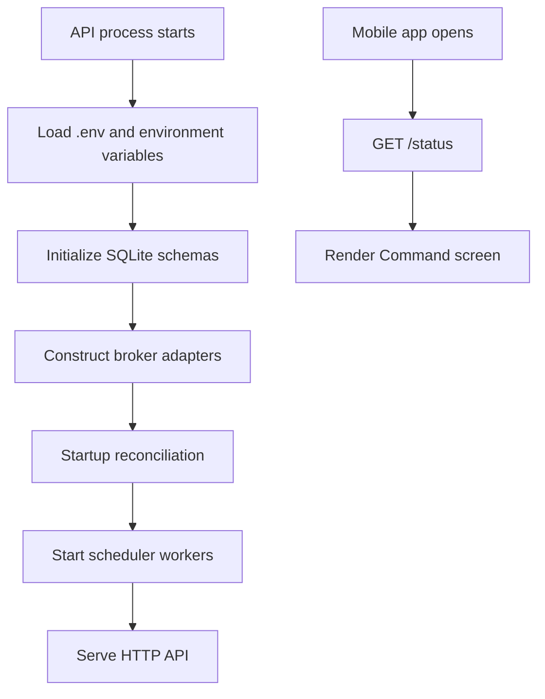
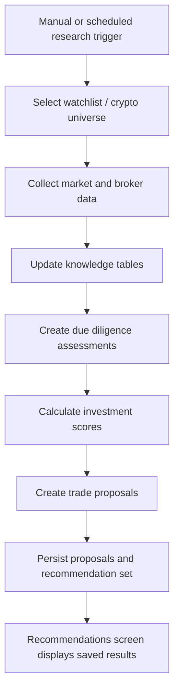
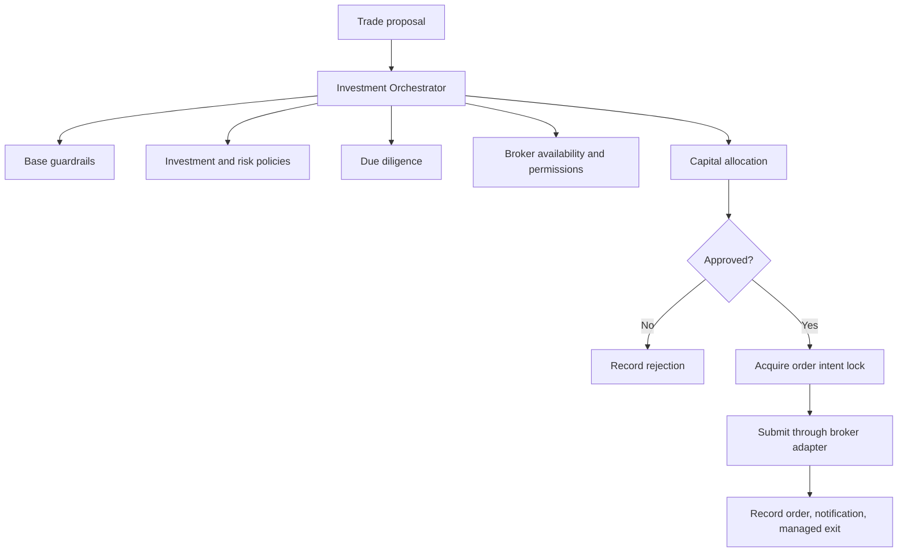

# Application Flow

## Application Start

Startup sequence:

1. `load_settings()` reads `.env` locally and environment variables in hosted deployment.
2. `LocalApiService` initializes audit, intelligence, benchmark, operational, foundation, multi-broker, control, and report schemas.
3. Broker adapters are created based on configured credentials.
4. Startup reconciliation checks stuck order intent locks and open managed exits.
5. Background workers start.
6. The API serves requests.
7. The mobile app loads status and renders current broker state.

## Research Flow

Research can be triggered through:

- Mobile Command screen Run Analysis.
- Mobile Recommendations screen Run Stock Analysis.
- Mobile Recommendations screen Run Kraken Analysis.
- Scheduler worker.
- CLI commands.

Research outputs:

- `RESEARCH_RUNS`
- `CRYPTO_RESEARCH_SCORES`
- `DUE_DILIGENCE_ASSESSMENTS`
- `INVESTMENT_SCORES`
- `trade_audit`
- `RECOMMENDATION_SETS`
- Notifications when relevant.

## Recommendation Flow

1. Market/research inputs are converted into `TradeProposal` objects.
2. Proposal fields include symbol, side, entry, stop loss, take profit, size, risk, confidence, news summary, sentiment summary, technical summary, and plain-English reasoning.
3. Proposals are persisted to SQLite.
4. Recommendation sets track which proposals belong to a particular run.
5. Mobile loads saved recommendations from SQLite.
6. Expired recommendations remain visible for audit, but execution is blocked unless freshness rules pass.

## Execution Flow

Execution entry points:

- Manual approval through `POST /approve-and-execute`.
- Autonomous batch through `POST /auto-execute-recommendations`.
- Background auto-execution worker.

The orchestrator rejects a trade if any required validation fails. Rejected trades are recorded. A broker adapter is only called after validation and order-intent locking.

## Broker Monitoring Flow

1. Background broker poller asks each configured broker for account state, positions, orders, and trades.
2. Account snapshots are written to `PORTFOLIO_SNAPSHOTS`.
3. Broker trades are written to `BROKER_TRADE_HISTORY`.
4. Notifications are created for new fills, accepted orders, closed orders, or broker failures.
5. UI reads the latest broker panel state from API status responses.

## Managed Exit Flow

Kraken does not provide the same paper/bracket semantics as Alpaca paper. For Kraken, accepted entries create `MANAGED_TRADE_EXITS` rows.

The managed exit worker:

1. Loads open managed exits.
2. Fetches current live price.
3. Updates trailing high/low water marks if trailing stop is enabled.
4. Checks stop loss.
5. Checks take profit.
6. If an exit is required, submits a closing order through the broker adapter.
7. Closes the managed exit row.
8. Creates `PERFORMANCE_ATTRIBUTION` when entry and exit prices are available.
9. Creates notification events.

## Reporting Flow

1. User requests Today, Yesterday, Morning, Evening, Weekly, Monthly, or broker-specific report.
2. API reads broker snapshots, trade history, performance attribution, orchestrator decisions, and learning notes.
3. Report markdown is generated.
4. Report row is inserted into `TRADING_REPORTS`.
5. Report file path is saved when file output is available.
6. Mobile opens `/reports/{id}` in a browser.

## Ask AI Flow

1. User enters a question in the Ask screen.
2. Mobile sends `POST /ask-ai-trader`.
3. API builds a read-only evidence context from SQLite and current status.
4. If OpenAI is configured and available, `OpenAIReadOnlyExplainer` creates a conversational explanation.
5. If OpenAI fails, local evidence summary is returned.
6. The Ask UI displays the latest question/answer cards.

Ask AI is intentionally read-only. It cannot place trades, approve trades, enable broker permissions, or change guardrails.

## Learning Flow

Learning happens through evidence review:

- Closed trade outcomes.
- Broker fills.
- Performance attribution.
- Rejected orchestrator decisions.
- Benchmark trader lessons.
- Research runs.

Learning produces observations and recommendations. It does not automatically change governance, broker permissions, or execution logic.
