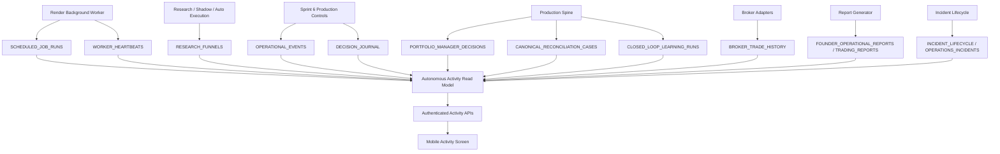

# Autonomous Activity Architecture

> Production Evidence Activation update: Activity now consumes the shared `/founder-evidence` read model. Worker research, broker snapshots, broker trade observations and learning outcomes are stored in Supabase/Postgres before they are displayed. The mobile app no longer depends on the legacy `/status` endpoint to populate Activity.

Date: 2026-07-19

## Purpose

The Autonomous Activity capability gives the Founder one place to answer:

> What has AI Trader actually done while I was not looking?

It is a read-only Founder visibility layer. It does not create trades, approve trades, change guardrails, enable brokers, or alter strategy settings.

## Design Principle

The screen is powered only by persisted application evidence. It does not use mock activity, frontend state, placeholder timestamps, or optimistic labels.

When evidence is missing, the UI must say so. A quiet system can be healthy or unhealthy, but the difference must come from worker heartbeats, scheduled job records, research funnels, broker records, incidents, and other stored operational evidence.

## Components

## Backend Module

`src/ai_trader/autonomous_activity.py` is the aggregation/read-model layer.

It provides:

- current autonomous status;
- period summary totals;
- timeline events;
- no-trade funnel;
- broker activity;
- Founder attention items;
- latest completed actions.

It deliberately does not create a duplicate table. The source records remain the system of truth.

## Mobile Integration

`mobile/App.js` adds a primary `Activity` tab and a compact `Autonomous Activity` card on the Dashboard.

The screen uses progressive disclosure:

- status first;
- 24-hour or selected-period summary second;
- timeline and filters third;
- no-trade explanation;
- broker status;
- Founder attention;
- latest completed actions.

## Operational Boundaries

The Activity screen proves visibility, not permission. A healthy Activity screen means AI Trader has current operating evidence. It does not mean a trade must occur.

Trading still requires:

- fresh research;
- valid strategy;
- Portfolio Manager approval;
- Risk Engine approval;
- Production Risk Sentinel approval;
- broker permissions;
- auto-trading setting;
- execution guardrails.
