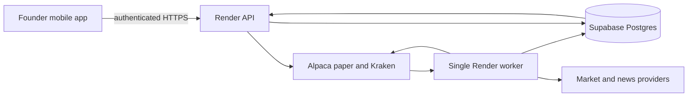

# Production Completion Architecture

## Purpose

This document defines the only supported hosted architecture after the Production Completion cutover. It replaces the previous split model in which always-on evidence used Postgres while trading-domain repositories opened process-local SQLite files.

## Production topology



The mobile application is a read and governed-command interface. It does not schedule research, keep the worker alive, reconcile brokers, or run learning. The API and worker share one Postgres database. SQLite is permitted only for local development, isolated tests, and the explicit historical migration source.

## Database authority

`src/ai_trader/database.py` is the mandatory DB-API connection provider. It selects Postgres when configured and fails closed when a hosted runtime requests SQLite or lacks a Postgres URL. Production modules no longer call `sqlite3.connect()` directly. The only direct SQLite opens retained are:

- `database.py`, for the local/test backend;
- `database_migration.py`, for reading a historical SQLite source during cutover;
- `db_browser.py`, an explicitly local read-only inspection utility.

The compatibility provider preserves the existing query contract while translating parameter markers, table metadata requests, additive schema DDL, conflict-safe inserts, rows and generated IDs. Ambiguous `INSERT OR REPLACE` is rejected. Production upserts must state their conflict behaviour explicitly.

## Mandatory decision pipeline

All hosted entry orders pass through `InvestmentOrchestrator.evaluate_recommendation()`:

```text
persisted research
  -> recommendation
  -> strategy maturity entitlement
  -> Portfolio Manager
  -> Risk Engine and deterministic guardrails
  -> Production Risk Sentinel
  -> canonical execution intent
  -> broker adapter
  -> canonical broker-order link
```

The Orchestrator owns the production decision packet. The API no longer performs a duplicate pre-check that callers could omit. `ExecutionEngine` remains for local demos and tests but raises in hosted runtimes before broker submission. Managed exits remain independent of the new-entry switch so existing positions retain stop/target protection.

## Canonical trade authority

Every governed order receives one `logical_trade_id` before broker submission. The ID links:

- the recommendation and decision context;
- execution intent;
- broker order and acknowledgement;
- immutable broker events;
- entry and exit fills;
- aggregate quantities and average prices;
- broker and exchange fees;
- gross and net P&L;
- terminal status and reconciliation confidence;
- exactly-once learning workflow.

`LOGICAL_TRADES` is the aggregate. `LOGICAL_TRADE_EVENTS` and `LOGICAL_TRADE_FILLS` are immutable evidence. Duplicate events and fills are rejected by idempotency keys and broker fill identities. Aggregate state is recomputed from the fill ledger, so partial, late and duplicate messages do not create additional trades.

## Terminal learning

Broker normalization calls canonical reconciliation. Only a canonical trade with entry quantity and fully matched exit quantity is terminal. That transition enqueues `closed-loop-learning:<broker>:<logical_trade_id>` once.

Complete evidence runs costs, R, excursions, attribution, review, experience and learning-proposal generation. Historical broker records that cannot support those calculations are marked `completed_insufficient_evidence`; no price, P&L or lesson is fabricated. Production parameters remain unchanged until a governed learning proposal is approved.

## Worker resilience

The existing single paid worker remains the owner of managed exits, scheduled research, auto-execution evaluation, broker polling, snapshots and learning. Durable job claims prevent duplicate scheduled work. Each worker job has an execution boundary controlled by `AI_TRADER_WORKER_JOB_TIMEOUT_SECONDS` (default 180 seconds). A timeout records:

- a `timed_out` scheduled-job result;
- an operations incident;
- a reason visible to Founder read models.

The heartbeat thread continues while a provider call is slow. A timed-out daemon call may still finish at provider level; order-intent locks and broker idempotency remain necessary to prevent duplicate side effects.

## Founder evidence

Founder APIs must read the shared Postgres records. Projection tables are read models, not alternative truth. Unknown and incomplete states must identify the missing source. API availability alone is not autonomous health. A healthy status requires current worker heartbeat, job evidence, database health, research/broker freshness and no blocking incident.

## Deployment boundary

Repository verification is complete. Hosted completion is not established until the latest commit is deployed and the checks in `PRODUCTION_COMPLETION_VERIFICATION.md` pass against Supabase and both configured brokers. No test or document substitutes for that evidence.
